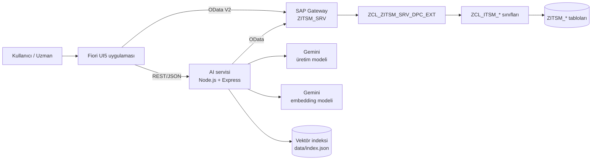

# AI Destekli ITSM Prototipi (SAP + Fiori + Gemini)

Son kullanıcı destek taleplerini ve SAP geliştirme/değişiklik taleplerini yapay zeka ile karşılayan, çağrının yaşam döngüsü boyunca destek uzmanına yardımcı olan bir ITSM prototipi.

- **Backend:** SAP ABAP (Z tabloları, iş mantığı sınıfları, SAP Gateway OData servisi)
- **Arayüz:** SAP Fiori / SAPUI5
- **AI servisi:** Node.js + Express, Google Gemini (üretim + embedding), RAG ve semantik arama

> Proje, staj kapsamında verilen "Yapay Zeka Destekli ITSM Uygulaması" teknik çalışması için geliştirilmiştir.

**Dokümantasyon:** [Mimari](docs/mimari.md) · [AI yaklaşımı](docs/ai-yaklasimi.md) · [Demo senaryoları](docs/demo-senaryolari.md) · [Bilinen kısıtlar](docs/bilinen-kisitlar.md) · [Örnek veri](sample-data/README.md)

---

## Mimari



- **SAP tek doğru kaynaktır.** Çağrılar, testler, gereksinimler, bilgi bankası ve AI önerileri SAP tablolarında tutulur.
- **AI servisi SAP'ye yazmaz.** Sadece öneri üretir; kayıtlar kullanıcı onayından sonra Fiori → OData üzerinden yazılır.
- **Vektör indeksi türetilmiş veridir.** SAP'deki kayıtlardan oluşturulur ve `/reindex` ile her an yeniden kurulabilir.
- **Model bağımsızlığı:** Tüm LLM çağrıları `geminiService.js`, embedding çağrıları `embeddingService.js` içinde toplanmıştır. Sağlayıcı değişikliği sadece bu iki dosyayı etkiler.

## Özellikler

| Gereksinim | Karşılığı |
|---|---|
| FR-01 Sohbet asistanı | Bağlamı koruyan sohbet (`/chat`), mesajlar `ZITSM_CONV` / `ZITSM_MSG` tablolarında |
| FR-02 Bilgi bankası destekli çözüm | RAG: en yakın KB makaleleri prompt'a eklenir, kullanılan kaynaklar ekranda gösterilir |
| FR-03 / FR-04 Sohbetten çağrı | Tek tıkla çağrıya dönüştürme; başlık, özet, etkilenen sistem, denenen adımlar sohbetten çıkarılır |
| FR-05 Sınıflandırma ve yönlendirme | Kategori ve destek grubu sadece SAP'deki `ZITSM_CATEGORY` listesinden seçilebilir |
| FR-06 Etki ve öncelik | Gerekçeli öncelik + etki önerisi (kullanıcı sayısı, iş kesintisi, workaround) |
| FR-07 Benzer çağrılar | Embedding tabanlı semantik arama, çözüm şekliyle birlikte gösterim |
| FR-08 Uzman özeti | Özet, denenen adımlar, muhtemel nedenler, sonraki aksiyonlar |
| FR-09 Tekrarlayan problem | Son 7 günde benzer çağrı sayısına göre Major Incident / Problem önerisi (LLM kullanmadan) |
| FR-10 KB taslağı | Çözülmüş çağrıdan Problem > Neden > Çözüm > Kontrol formatında taslak, uzman onayıyla kayıt |
| FR-11 – FR-14 Doküman → gereksinim → test | PDF'ten gereksinim çıkarımı (5 tip) ve test üretimi (pozitif, negatif, sınır, yetki, regresyon), REQ → TEST bağlantısı |
| FR-15 – FR-17 Test yönetimi | Başarılı / Başarısız / Uygulanamaz sonucu, not, ekran görüntüsü kanıtı, düzenleme/silme/ekleme |
| FR-18 / FR-19 Resolved kontrolü | Kritik testler başarılı değilse ve çözüm metni yoksa Resolved engellenir; engelleyen maddeler listelenir |
| FR-20 Test geçmişi | Her sonuç, sıfırlama, düzenleme ve silme `ZITSM_TEST_HIST` tablosuna yazılır |

**Bonus özellikler:** Major Incident / Problem önerisi, SLA göstergesi, gerekçeli önceliklendirme, benzer taleplerden test önerisi, doküman revizyonu fark analizi, reddedilen öneriler için geri bildirim, release note üretimi, AI performans dashboard'u.

## AI Kullanım Yaklaşımı

- **Yapılandırılmış çıktı:** Tüm çağrılar `responseMimeType: application/json` ile yapılır. Gelen JSON kodda doğrulanır; izin verilmeyen değerler (kategori, destek grubu, test tipi vb.) elenir.
- **Halüsinasyon koruması:** Modelin "kullandım" dediği kaynaklardan sadece gerçekten prompt'a verilenler gösterilir.
- **Sayılar koddan gelir:** Test sayıları, etkilenen testler ve tekrar sayıları LLM'e sorulmaz, veriden hesaplanır.
- **Yüzde yok:** Keyfi LLM güven yüzdeleri yerine gerekçe metni ve gerçek kosinüs benzerlik skoru gösterilir.
- **İnsan onayı:** Her AI önerisi düzenlenebilir bir pencerede gösterilir. Kullanıcının kararı (A = kabul, M = değiştirildi, R = reddedildi), son değer, geri bildirim ve model adı `ZITSM_AISUG` tablosuna yazılır.
- **KVKK:** E-posta, telefon, IBAN, TCKN ve kart numaraları modele gönderilmeden maskelenir.
- **RAG:** Sohbet ve analizde, kullanıcı metnine anlamca en yakın bilgi bankası makaleleri (`gemini-embedding-001`, kosinüs benzerliği) prompt'a bağlam olarak eklenir.

Prompt yapısı, doğrulama kuralları, eşik değerleri ve izlenebilirlik detayları: [docs/ai-yaklasimi.md](docs/ai-yaklasimi.md)

## Demo Senaryoları

İki senaryo da canlı sistemde baştan sona çalıştırıldı. Adım adım anlatım: [docs/demo-senaryolari.md](docs/demo-senaryolari.md)

**A – VPN sorunu (son kullanıcı):** Kullanıcı sorunu sohbette anlatır → asistan bilgi bankasından çözüm önerir ve kaynağı gösterir → sorun çözülmeyince sohbet tek tıkla çağrıya dönüşür, alanlar sohbetten dolar → uzman benzer çağrıları ve AI özetini görür → çağrı çözülür, bilgi bankası taslağı üretilir → yeni makale bir sonraki kullanıcıya önerilir → aynı sorun tekrarlayınca Problem kaydı önerilir.

**B – ME21N limit kontrolü (SAP geliştirme talebi):** Talep PDF'i yüklenir → AI çağrı alanlarını doldurur → atama sonrası 11 gereksinim ve REQ'e bağlı test senaryoları üretilir → uzman testleri düzenler → revize doküman yüklenir, fark analizi değişen / kaldırılan / yeni gereksinimleri ve etkilenen testleri gösterir → testler sonuçlandırılır, kanıt eklenir → kritik test eksikken Resolved engellenir → tamamlanınca release note üretilir.

## Repo Yapısı

```
ai-service/         Node.js AI servisi (Gemini, RAG, semantik arama)
fiori/              SAPUI5 uygulaması
sap/abap/classes/   ABAP sınıfları (iş mantığı + OData DPC_EXT)
sap/abap/programs/  ABAP programları (klasik ALV raporu, kod dışa aktarma aracı)
sap/ddic/           Tablo tanımları
sample-data/        Örnek talep dokümanları, bilgi bankası, geçmiş çağrılar, kategoriler
docs/               Mimari, AI yaklaşımı, demo senaryoları, bilinen kısıtlar
```

## Kurulum

### 1. SAP backend

1. `sap/ddic/tables.md` dosyasındaki `ZITSM_*` tablolarını SE11 ile oluşturun.
2. `ZITSM` mesaj sınıfını ve `ZITSM_INC` numara aralığı nesnesini (aralık `01`) oluşturun.
3. `sap/abap/classes` altındaki sınıfları SE24'te oluşturun (Source Code-Based görünümde yapıştırılabilir).
4. SEGW'de `ZITSM_SRV` projesini oluşturun. Entity set'ler: `IncidentSet`, `IncidentLogSet`, `AttachmentSet`, `CategorySet`, `ConversationSet`, `MessageSet`, `ExpertSet`, `KnowledgeArticleSet`, `RequirementSet`, `TestSet`, `TestHistorySet`, `SuggestionSet`, `ReleaseNoteSet`. Projeyi generate edin; DPC_EXT sınıfının kodu bu repodaki `zcl_zitsm_srv_dpc_ext.clas.abap` dosyasıdır.
5. `/IWFND/MAINT_SERVICE` ile `ZITSM_SRV_SRV` servisini kaydedin.
6. `ZITSM_CATEGORY` tablosuna SM30 ile kategori ve destek gruplarını girin.

### 2. AI servisi

```bash
cd ai-service
npm install
cp .env.example .env      # GEMINI_API_KEY ve SAP bağlantı bilgilerini girin
npm start                 # http://localhost:3001
```

`http://localhost:3001/health` adresi servis durumunu, indeks boyutunu ve kategori kaynağını (SAP / yedek liste) gösterir.

Kullanılan model `config.js` içinde tek bir sabittir (`MODEL`, şu an `gemini-3.5-flash`).

| Endpoint | Açıklama |
|---|---|
| `POST /analyze` | Metin veya PDF analizi: başlık, öncelik, etki, kategori, gereksinim, test |
| `POST /chat` | Sohbet asistanı (RAG) |
| `POST /summary` | Uzman için çağrı özeti |
| `POST /kb-draft` | Bilgi bankası makale taslağı |
| `POST /requirement-diff` | Revize doküman ile gereksinim fark analizi |
| `POST /release-note` | Değişiklik özeti |
| `POST /similar`, `POST /recurring` | Semantik arama, tekrarlayan problem kontrolü |
| `POST /reindex`, `/index-item`, `/index-remove` | Vektör indeksi yönetimi |

### 3. Fiori uygulaması

```bash
cd fiori
npm install
npm start                 # http://localhost:8080
```

`ui5.yaml` içindeki proxy `/sap` isteklerini SAP Gateway'e yönlendirir (`baseUri` kendi sisteminize göre değiştirilmelidir). İlk açılışta listedeki **İndeksi Yenile** butonu ile SAP kayıtları arama indeksine aktarılır.

## Bilinen Kısıtlar

- Rol bazlı (PFCG) yetki kontrolü yoktur; kritik test kuralı sadece Fiori'de uygulanır.
- `MAX + 1` ile üretilen anahtarlar yoğun eşzamanlı kullanımda çakışabilir.
- Vektör indeksi tek bir JSON dosyasındadır; PDF içeriği indekse eklenmez.
- LLM çıktıları küçük farklılıklar gösterebilir; bu yüzden tüm öneriler kullanıcı onayına sunulur.

Tam liste ve geliştirilebilecek alanlar: [docs/bilinen-kisitlar.md](docs/bilinen-kisitlar.md)
