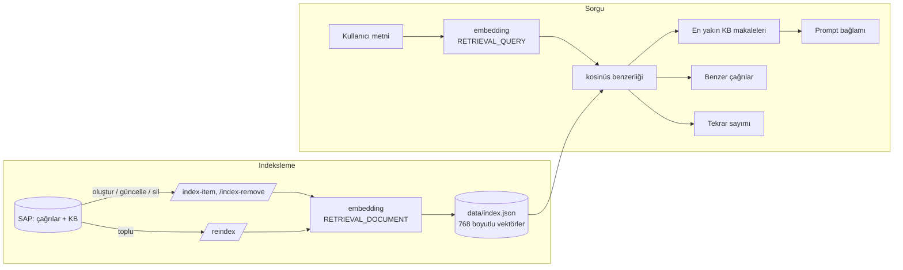

# AI Kullanım Yaklaşımı

Bu doküman AI'ın uygulamanın hangi noktalarında kullanıldığını, prompt ve yapılandırılmış çıktı yaklaşımını, bilgi erişim (RAG / semantik arama) yöntemini ve AI çıktısının iş akışına nasıl güvenli şekilde bağlandığını açıklar.

## 1. Temel İlkeler

| İlke | Uygulama |
|---|---|
| **AI öneri üretir, karar kullanıcınındır** | AI servisi SAP'ye hiçbir kayıt yazmaz. Her öneri düzenlenebilir bir pencerede gösterilir, kayıt kullanıcı onayından sonra Fiori → OData ile yazılır. |
| **Serbest metin değil, yapılandırılmış çıktı** | Tüm üretim çağrıları `responseMimeType: application/json` ile yapılır ve gelen JSON kodda doğrulanır. |
| **Model sadece izin verilen listeden seçer** | Kategori, destek grubu, uzmanlık, gereksinim tipi ve test tipi önceden tanımlı listelerle karşılaştırılır. Liste dışı değerler atılır. |
| **Sayılar ve ilişkiler koddan gelir** | Test sayıları, etkilenen testler, tekrar sayıları ve benzerlik skorları LLM'e sorulmaz, veriden hesaplanır. |
| **Keyfi güven yüzdesi yok** | Sınıflandırma ve öncelik için yüzde yerine gerekçe metni gösterilir. Ekranda görünen tek yüzde, embedding vektörleri arasındaki gerçek kosinüs benzerliğidir; yanında iki metnin ortak ifadeleri gerekçe olarak gösterilir. |
| **Her AI kararı izlenebilir** | Öneri, kullanıcının kararı, son değer, geri bildirim, kaynak ve model adı SAP'de saklanır. |

## 2. AI Kullanım Noktaları

| Ekran / Adım | Endpoint | Girdi | Çıktı | Gereksinim |
|---|---|---|---|---|
| Sohbet | `POST /chat` | Sohbet geçmişi + ilgili KB makaleleri + çözülmüş benzer çağrılar | Cevap metni, kullanılan kaynaklar | FR-01, FR-02 |
| Sohbet → Çağrı Oluştur | `POST /analyze` | Sohbet dökümü | Başlık, özet, etkilenen sistem, denenen adımlar, kategori, destek grubu, öncelik, etki, tür | FR-03 – FR-06 |
| Yeni Incident → AI ile Öner | `POST /analyze` | Açıklama metni ve/veya PDF | Aynı alanlar + çözüm önerileri + uzmanlık alanları | FR-04 – FR-06, FR-11 |
| Detay → atama sonrası | `POST /analyze` | Talep PDF'i (yoksa açıklama) | Gereksinimler (5 tip) ve test senaryoları (5 tip, REQ bağlantılı) | FR-12 – FR-14 |
| Detay → Benzer Geçmiş Çağrılar | `POST /similar` | Çağrı metni | En yakın çağrılar, skor, ortak ifadeler, çözüm şekli | FR-07 |
| Detay → tekrarlayan problem | `POST /recurring` | Çağrı metni | Son 7 gündeki benzer çağrı sayısı, Major Incident / Problem önerisi | FR-09 |
| Detay → Özet Oluştur | `POST /summary` | Başlık + açıklama | Özet, denenen adımlar, muhtemel nedenler, sonraki aksiyonlar | FR-08 |
| Detay → Bilgi Bankası Makalesi | `POST /kb-draft` | Çağrı, uzmanın çözüm metni, test notları | Problem, kök neden, çözüm, kontrol adımları, etiketler | FR-10 |
| Detay → Revizyon Analizi | `POST /requirement-diff` | Mevcut gereksinimler + testler + revize PDF | Eklenen / değişen / kaldırılan gereksinimler | Bonus |
| Detay → Benzer Taleplerden Öner | `POST /similar` | Çağrı metni | Benzer taleplerde başarılı olmuş testler | Bonus |
| Detay → Resolved sonrası | `POST /release-note` | Çağrı, çözüm, gereksinimler, test sonuçları | Değişiklik özeti | Bonus |

LLM'e giden tüm metinlerde e-posta, telefon, IBAN, TCKN ve kart numaraları önce maskelenir (`maskPII`).

## 3. Prompt ve Yapılandırılmış Çıktı

Her endpoint için prompt, `geminiService.js` içinde tek bir yerde üretilir. Prompt'lar ortak bir yapıyı izler:

1. **Rol:** "Sen bir ITSM asistanısın…"
2. **Çıktı sözleşmesi:** "SADECE geçerli bir JSON döndür" ve her alanın adı, tipi ve izin verilen değerleri.
3. **Alan kuralları:** her alan için ne zaman doldurulacağı, ne zaman boş bırakılacağı ("metinde geçmiyorsa `""` döndür, UYDURMA").
4. **İzinli listeler:** kategori ve destek grubu listesi SAP'deki `ZITSM_CATEGORY` tablosundan, çalışma anında prompt'a eklenir.
5. **Bağlam:** varsa bilgi bankası kayıtları, ardından maskelenmiş kullanıcı metni veya PDF.

`/analyze` için istenen JSON'un özeti:

```json
{
  "requestType": "incident | request",
  "title": "…", "summary": "…", "affectedSystem": "…",
  "priority": "Low | Medium | High", "impact": "Low | Medium | High", "reason": "…",
  "category": "<ZITSM_CATEGORY listesinden>", "supportGroup": "<izinli listeden>", "categoryReason": "…",
  "triedSteps": ["…"], "suggestedSolutions": ["…"], "usedSources": ["KB-…"],
  "expertise": ["<izinli listeden>"],
  "requirements": [{ "id": "REQ-01", "text": "…", "type": "functional | business-rule | boundary | constraint | affected-area", "sourceRef": "…" }],
  "testSteps": [{ "text": "…", "expectedResult": "…", "type": "pozitif | negatif | sinir | yetki | regresyon", "isCritical": true, "reqId": "REQ-01" }],
  "needMoreInfo": false
}
```

Öncelik ve etki için prompt'ta açık ölçütler verilir. Model sadece "acil/kritik" kelimelerine bakmamalı; etkilenen kullanıcı sayısını, iş kesintisini, finansal/operasyonel etkiyi ve workaround olup olmadığını değerlendirmelidir. Test tipleri de örnekleriyle tanımlanır (örneğin *negatif = istenmeyen davranışın oluşmadığını doğrular*).

### Doğrulama (`cleanResponse`)

Model cevabı ne olursa olsun uygulamaya şu kontrollerden geçtikten sonra gider:

- Kategori, destek grubu ve uzmanlık **büyük/küçük harf duyarsız olarak izinli listeyle eşleştirilir**. Eşleşmeyen değer `null` olur.
- Öncelik ve etki sadece `Low / Medium / High` olabilir. Gereksinim ve test tipleri tanımlı listelerin dışındaysa varsayılana çekilir.
- Testlerin `reqId` değeri, aynı cevaptaki gereksinim kimlikleriyle eşleşmiyorsa boşaltılır.
- `usedSources` içinde sadece **gerçekten prompt'a verilmiş** KB kayıtları bırakılır. Model var olmayan bir kaynak uydurursa ekranda görünmez.
- Talep (`request`) türünde çözüm önerisi listesi boşaltılır.
- Model `needMoreInfo: true` dönerse başlık, öncelik, kategori gibi alanlar doldurulmaz; kullanıcıdan detay istenir.
- Metinler SAP alan uzunluklarına göre kısaltılır.

### Hata yönetimi

- 500 / 503 gibi geçici hatalar 1 ve 2 saniye beklenerek toplam 3 kez denenir. 429 (kota) hatası tekrar denenmez.
- Geçersiz JSON gelirse istek 1 kez daha gönderilir.
- Kullanıcıya duruma göre anlamlı bir Türkçe mesaj gösterilir ("AI servisi şu anda yoğun", "kota doldu" gibi).
- Bilgi bankası araması başarısız olursa analiz bağlamsız olarak devam eder.

## 4. Bilgi Erişimi: RAG ve Semantik Arama



- **Embedding modeli:** `gemini-embedding-001`, 768 boyut. Vektörler normalize edilir, böylece kosinüs benzerliği basit bir iç çarpım olur.
- **İndekslenen metin:** çağrılar için *başlık + açıklama + çözüm*, KB makaleleri için *başlık + problem + çözüm*. Çağrıların durum, öncelik, açılış tarihi ve çözüm metni `meta` alanında saklanır.
- **Senkronizasyon:** çağrı oluşturma ve kaydetme, KB ekleme, düzenleme ve silme anında indeks güncellenir. İndeks türetilmiş veridir; **İndeksi Yenile** butonu (`/reindex`) SAP'deki tüm kayıtlardan yeniden kurar.

| Kullanım | Filtre | Eşik | Sonuç sayısı |
|---|---|---|---|
| RAG: bilgi bankası | `kind = kb` | 0.55 | 3 |
| RAG: çözülmüş geçmiş çağrılar | `kind = incident`, durumu Resolved/Closed ve çözüm metni dolu | 0.70 | 2 |
| Benzer çağrılar (FR-07) | `kind = incident`, kendisi hariç | 0.70 | 5 |
| Tekrarlayan problem (FR-09) | `kind = incident`, son 7 gün | 0.72 | eşik: 3 çağrı |

**RAG akışı:** kullanıcının yazdıkları sorgu olarak kullanılır ve tek bir embedding çağrısıyla indekste aranır. Eşiği geçen en yakın 3 KB makalesi `[KB-id] başlık + metin`, çözülmüş en yakın 2 çağrı da `[INC-id] başlık + Çözüm: uzmanın çözüm metni` biçiminde prompt'a eklenir. Modelden önce bu çözümleri kullanması ve yararlandığı kaynağın kimliğini `usedSources` alanında belirtmesi istenir. Ekranda gösterilen kaynaklar ("Bilgi bankası: …", "Çözülmüş çağrı: …"), modelin beyanı ile gerçekten verilen kaynakların kesişimidir.

**Benzerlik gerekçesi (FR-07):** her benzer çağrı için iki metinde ortak geçen anlamlı kelimeler (genel kelimeler filtrelenir, Türkçe ekler için kelimenin ilk 5 harfi karşılaştırılır) "Ortak ifadeler" olarak gösterilir. Bu gerekçe LLM'e sorulmaz, deterministik olarak hesaplanır ve kota harcamaz.

**Tekrarlayan problem (FR-09):** LLM çağrısı yapılmaz. Son 7 gün içinde açılmış, benzerliği 0.72'nin üstünde en az 3 çağrı varsa uyarı verilir. Bunların en az 3'ü hâlâ açıksa **Major Incident**, değilse **Problem kaydı** önerilir. Açılış tarihi bilinmeyen kayıtlar, yakın tarihli oldukları kanıtlanamadığı için sayılmaz.

**PDF dokümanlar:** PDF metne çevrilmeden doğrudan modele verilir (Gemini PDF'i kendisi okur). Bu yüzden sadece PDF ile yapılan analizde RAG araması yapılmaz.

## 5. İnsan Onayı ve İzlenebilirlik

Her AI önerisi `ZITSM_AISUG` tablosuna şu bilgilerle yazılır:

| Alan | İçerik |
|---|---|
| `SUG_TYPE` | TITLE, PRIORITY, IMPACT, CATEGORY, SUPPORTGROUP, REQUESTTYPE, SUMMARY, REVISION, TESTPLAN, TESTREVIEW |
| `SUG_VALUE` / `REASON` | AI'ın önerdiği değer ve gerekçesi |
| `SOURCE_REF` | Yararlanılan KB kayıtları |
| `MODEL_NAME` | Öneriyi üreten model |
| `DECISION` | **A** = olduğu gibi kabul, **M** = değiştirildi, **R** = reddedildi (boş bırakıldı) |
| `FINAL_VALUE` | Kullanıcının kaydettiği son değer |
| `USER_FEEDBACK` | Değiştirme veya reddetme gerekçesi |
| `CREATED_BY / ON / AT` | Kim, ne zaman |

Karar, kullanıcıya sorulmadan otomatik hesaplanır: kaydedilen değer AI'ın önerisiyle aynıysa A, boşsa R, farklıysa M.

**AI test planı (FR-17):** AI gereksinim ve test ürettiğinde bir `TESTPLAN` kaydı yazılır: ne zaman, hangi model, hangi kaynaktan (PDF adı veya açıklama) ve hangi test numaraları üretildi. Uzman testleri gözden geçirip **Test Planını Onayla** dediğinde bir `TESTREVIEW` kaydı oluşur: onaylayan, tarih ve uzmanın plana yaptığı değişiklikler (düzenleme, silme, ekleme sayısı). Plan değiştirilmeden onaylandıysa karar A, değiştirildiyse M olur. AI'ın ürettiği plan onaylanmadan çağrı Resolved yapılamaz.

Release note'lar `ZITSM_RELNOTE` tablosunda onaylayan kişi, tarih, karar ve model adıyla saklanır. Test adımlarındaki her sonuç, sıfırlama, düzenleme ve silme `ZITSM_TEST_HIST` tablosuna yazılır. Revizyon analizinin uygulanması da `REVISION` tipinde bir AI önerisi olarak kaydedilir.

**Genel Bakış** ekranı bu verilerden şu göstergeleri hesaplar: AI ile çözülen sohbet oranı, çağrıya dönüşme oranı, test başarı oranı, değiştirilmeden kabul edilen öneri oranı ve öneri tipine göre kararlar.

## 6. Model Bağımsızlığı

- Tüm üretim çağrıları `geminiService.js` içindeki tek bir fonksiyondan (`callGeminiOnce`), embedding çağrıları `embeddingService.js` içinden geçer. Uygulamanın geri kalanı sağlayıcıyı bilmez.
- Model adı `config.js` içinde tek bir sabittir. Prova sırasında `gemini-3.6-flash` aşırı yoğunluk (503) verdiğinde bu satır `gemini-3.5-flash` olarak değiştirildi ve başka hiçbir kod değişmeden çalışmaya devam edildi. Yeni öneriler `MODEL_NAME` alanına yeni modelin adıyla kaydedildi.
- Başka bir sağlayıcıya geçmek için sadece bu iki servis dosyasının değiştirilmesi yeterlidir. Embedding modeli değişirse indeks dosyası uyumsuzluğu otomatik algılar ve `/reindex` ister.
