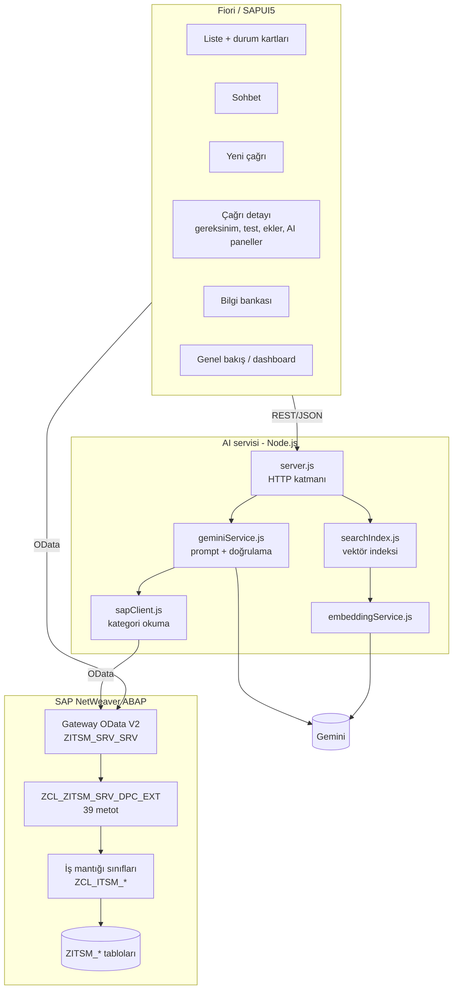
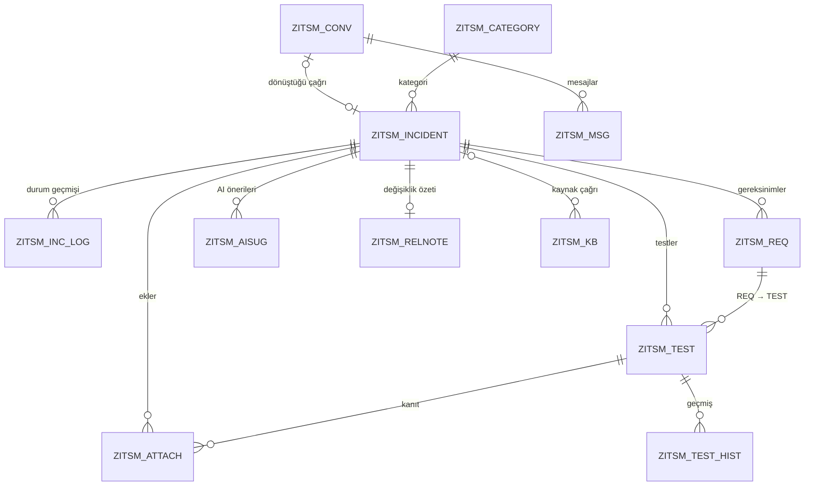

# Mimari ve Teknik Tasarım

## 1. Katmanlar

| Katman | Sorumluluk |
|---|---|
| **Fiori** | Ekranlar, kullanıcı onay pencereleri, iş kurallarının ön kontrolü (Resolved engeli), SAP ile AI servisi arasında veri taşıma |
| **DPC_EXT** | OData isteklerini iş mantığı sınıflarına çevirir; filtre, anahtar ve hata mesajı yönetimi |
| **ZCL_ITSM_\*** | Tüm iş kuralları ve veritabanı erişimi. Her nesne için ayrı sınıf. |
| **AI servisi** | LLM ve embedding çağrıları, prompt üretimi, cevap doğrulama, semantik arama. SAP'ye yazmaz. |

## 2. ABAP Sınıfları

| Sınıf | Metotlar | Not |
|---|---|---|
| `ZCL_ITSM_INCIDENT` | create / update / get / list, validate_input, write_status_log, send_assignment_mail | Numara aralığı `ZITSM_INC`. Çözüm metni olmadan Resolved'a geçiş `ZITSM 010` ile engellenir. Atamada uzmana e-posta gönderilir. |
| `ZCL_ITSM_TEST` | get / create / update / edit / delete, get_history | Sonuç girme ve tanım düzenleme ayrı metotlar. Değişmeyen kayıt için geçmiş yazılmaz. Silinen testin numarası tekrar kullanılmaz. |
| `ZCL_ITSM_REQ` | get / create / update / delete | Dokümandan çıkarılan gereksinimler |
| `ZCL_ITSM_ATTACHMENT` | get / create / delete | `TEST_ID` doluysa dosya o testin kanıtıdır (FR-16) |
| `ZCL_ITSM_AISUG` | create_suggestion, update_decision, get | AI öneri ve karar kaydı |
| `ZCL_ITSM_CHAT` | create_conversation, add_message, get_messages, set_outcome | Sohbet sonucu: R = AI ile çözüldü, T = çağrıya dönüştü |
| `ZCL_ITSM_KB` | get / create / update / delete | Bilgi bankası |
| `ZCL_ITSM_RELNOTE` | get_note, save_note | Çağrı başına tek değişiklik özeti |
| `ZCL_ITSM_CATEGORY` | get_categories | Kategori → destek grubu, SM30 ile bakım |
| `ZCX_ITSM_EXCEPTION` | – | T100 mesajlı istisna sınıfı (`ZITSM` mesaj sınıfı) |

`ZITSM_MAIN` (ve include'ları) projenin ilk aşamasında yazılmış klasik SAP GUI ALV raporudur. `ZITSM_DPC_BACKUP` tüm sınıfları, programları ve tablo tanımlarını tek bir metin dosyasına dışa aktarır; bu repodaki ABAP dosyaları bu araçla sistemden alınmıştır.

## 3. Veri Modeli

Alan listesi: [`sap/ddic/tables.md`](../sap/ddic/tables.md). Task dokümanındaki önerilen nesnelerle eşleşme:

| Task nesnesi | Tablo |
|---|---|
| Ticket / Çağrı | `ZITSM_INCIDENT`, `ZITSM_INC_LOG` |
| Conversation | `ZITSM_CONV`, `ZITSM_MSG` |
| Attachment | `ZITSM_ATTACH` |
| Requirement | `ZITSM_REQ` |
| Test Case + Test Execution | `ZITSM_TEST` (tanım + son sonuç), `ZITSM_TEST_HIST` (tüm sonuç ve değişiklik geçmişi) |
| Knowledge Article | `ZITSM_KB` |
| AI Suggestion | `ZITSM_AISUG` |
| (ek) | `ZITSM_CATEGORY` yönlendirme, `ZITSM_EXPERT` uzmanlık → kişi, `ZITSM_RELNOTE` değişiklik özeti, `ZITSM_USER` e-posta |

## 4. OData Servisi (`ZITSM_SRV_SRV`)

| Entity set | İşlemler | Not |
|---|---|---|
| `IncidentSet` | GET, GET entity, POST, MERGE | |
| `IncidentLogSet` | GET | Durum geçmişi |
| `AttachmentSet` | GET, GET entity, POST, DELETE | İçerik base64 |
| `RequirementSet` | GET, GET entity, POST, MERGE, DELETE | `$filter=IncidentNo` |
| `TestSet` | GET, GET entity, POST, MERGE, DELETE | Filtresiz GET dashboard içindir |
| `TestHistorySet` | GET | `IncidentNo` filtresi zorunlu, salt okunur |
| `SuggestionSet` | GET, POST, MERGE | |
| `ReleaseNoteSet` | GET entity, POST, MERGE | Kayıt yoksa boş kayıt döner |
| `ConversationSet` | GET, GET entity, POST, MERGE | Sohbet sonucu (R / T) |
| `MessageSet` | GET, POST | |
| `KnowledgeArticleSet` | GET, GET entity, POST, MERGE, DELETE | |
| `CategorySet` | GET | Sadece aktif kategoriler |
| `ExpertSet` | GET | Uzmanlık alanına göre kişi |

## 5. Tasarım Kararları

- **SAP tek doğru kaynak, AI servisi durumsuz öneri katmanı.** AI servisi çökse bile çağrı, test ve bilgi bankası işlemleri çalışır; sadece AI önerileri gelmez. Vektör indeksi kaybolsa bile SAP'den yeniden kurulur.
- **Kategoriler SAP'de.** Yönetici kategori ve destek gruplarını SM30 ile değiştirir. AI servisi listeyi SAP'den okur (5 dakika önbellek). SAP'ye ulaşılamazsa `config.js` içindeki yedek liste kullanılır ve 1 dakika sonra tekrar denenir.
- **Kritik iş kuralları iki katmanda.** Resolved için çözüm metni zorunluluğu hem Fiori'de hem ABAP'ta (`ZITSM 010`) kontrol edilir. Kritik test kontrolü Fiori'de, engelleyen maddeleri listeleyerek yapılır.
- **Sıralı kayıt.** AI'ın ürettiği gereksinim, test ve öneri kayıtları tek tek, sırayla oluşturulur; paralel istekler `MAX + 1` anahtar üretiminde çakışıyordu. Gereksinimler önce kaydedilir, AI'ın `REQ-01` etiketleri SAP'nin ürettiği gerçek anahtarlara eşlenir, testler bu anahtarlarla bağlanır.
- **Test sonucu ile tanımı ayrı.** Test tanımı değişirse önceki sonuç geçersiz sayılır ve kullanıcı onayıyla sıfırlanır. Revizyonda etkilenen testlerin sonucu da sıfırlanır. Her iki durum da geçmişe yazılır.

## 6. Geliştirme Sırasında Öğrenilenler

- **SEGW kodu `DPC_EXT` sınıfına yazılmalı.** Kodun ilk sürümü yanlışlıkla temel `ZCL_ZITSM_SRV_DPC` sınıfına yazılmıştı. SEGW projesi yeniden generate edildiğinde temel sınıf baştan üretildiği için kod silindi. Tüm metotlar `ZCL_ZITSM_SRV_DPC_EXT` sınıfına redefinition olarak taşındı.
- **OData MERGE önce GET_ENTITY çağırır.** `REQUIREMENTSET_GET_ENTITY` eksik olduğu için güncelleme çalışmıyordu.
- **Entity property adı entity adıyla aynı olamaz.** `Category` entity'sindeki `Category` alanı `CategoryName` olarak değiştirildi.
- **Çift tekrar deneme kotayı tüketir.** Servis hatasında hem dış döngü hem `callGemini` tekrar deniyordu; tek istek 6 çağrıya dönüşüp kotayı bitiriyordu. Tekrar deneme tek bir katmanda bırakıldı.
